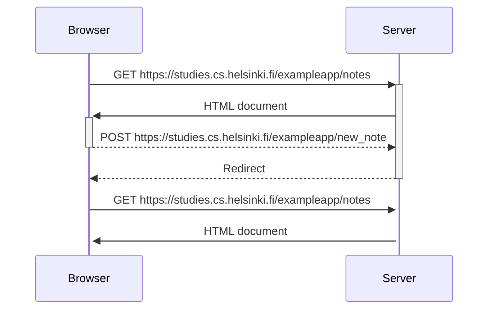
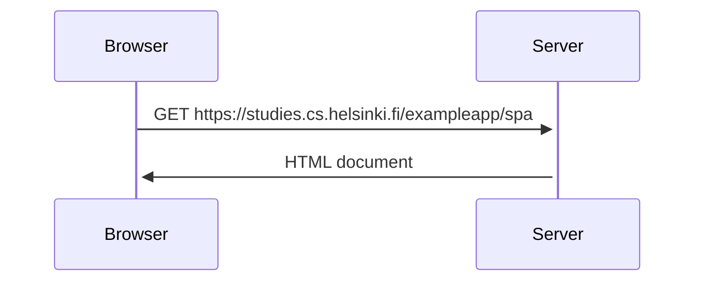
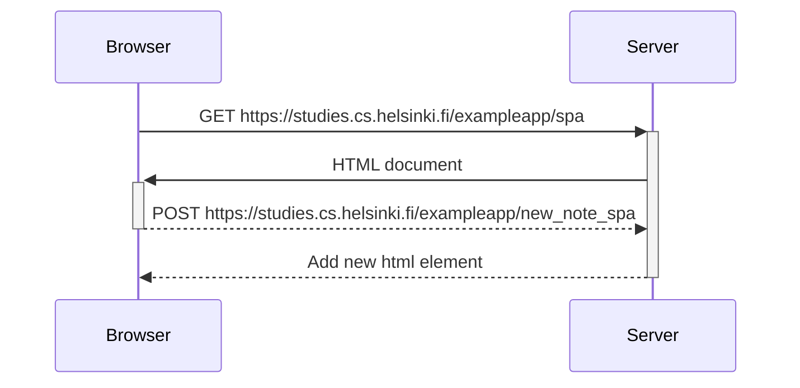

PARTS 0.4-0.6

```mermaid

sequenceDiagram
    Browser->>+Server: GET https://studies.cs.helsinki.fi/exampleapp/notes
    Server->>+Browser: HTML document

    Browser-->>-Server: POST https://studies.cs.helsinki.fi/exampleapp/new_note
    Server-->>-Browser: Redirect
    
    Browser->>+Server: GET https://studies.cs.helsinki.fi/exampleapp/notes
    Server->>+Browser: HTML document

```

```mermaid
sequenceDiagram
    Browser->>+Server: GET https://studies.cs.helsinki.fi/exampleapp/spa
    Server->>+Browser: HTML document

```

```mermaid
sequenceDiagram
    Browser->>+Server: GET https://studies.cs.helsinki.fi/exampleapp/spa
    Server->>+Browser: HTML document

    Browser-->>-Server: POST https://studies.cs.helsinki.fi/exampleapp/new_note_spa
    Server-->>-Browser: Add new html element

```

